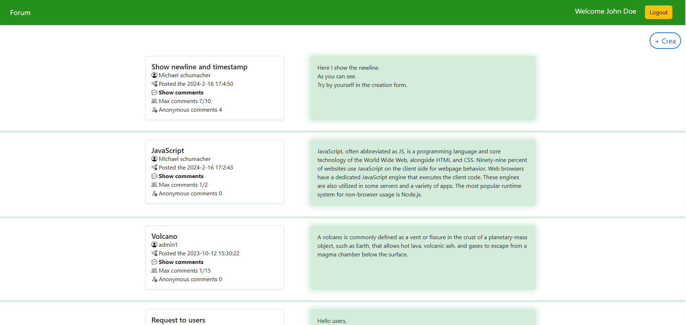
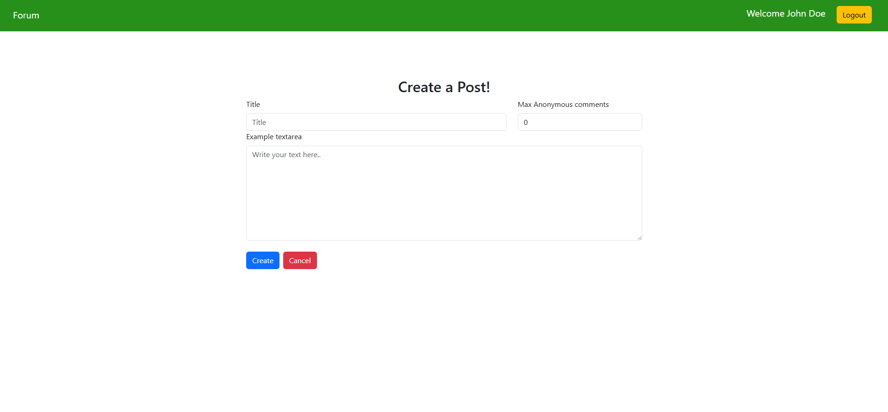
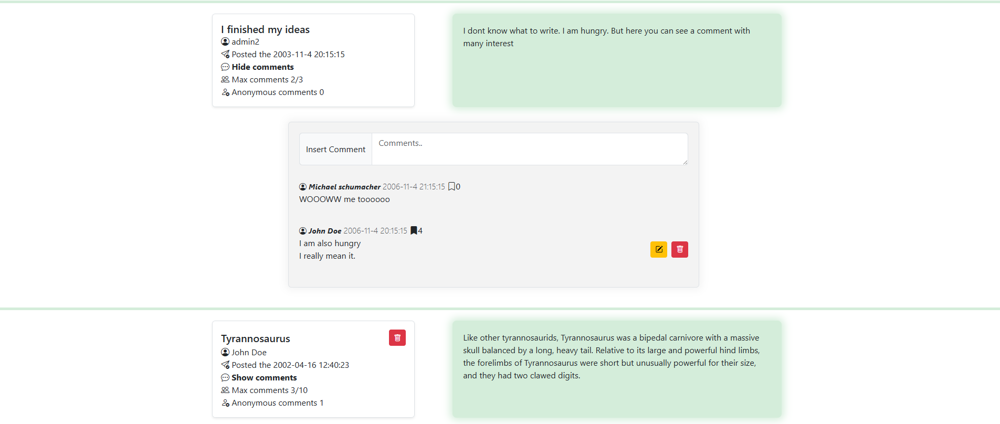

# Javascript single page web application
## Exam #1: "Forum"
Code got from past exam at Politecnico di Torino

## React Client Application Routes

- Route `/`: it contains the Forum main page, where inside we can find all the links and buttons to interact with the application.
- Route `/login`: it contains the login form where you can insert your credentials to enter as user or admin. Button to access this route always accessible.
- Route `/login-totp`: it contains a single text place where the admin can insert the TOTP value. This form will be accessed after an admin entered the credentials inside the `/login` route. There the admin can decide if he/she wants to access as user or administrator role, and in case it will need to insert the TOTP code.
- Route `/add`: it contains the form to create a post. Button to access this route is accessible only after login with credentials.
- Route `/*`: it's a page if users try to access a route I didn't define.
> Note: We can find more information about the route structure throguh [route structure:](#route-structure).
## API Server

### User API:
- POST `/api/session/login`
  - Description: We authenticate the user who is trying to login. 
  - Request Body:
   ``` json
  {
    "username": "u1@p.it",
    "password": "pwd"
  }
  ```
  - Response body:
  ``` json
  {
    "id": 1,
    "name": "John Doe",
    "canDoTotp": false,
    "isTotp": false
  }
  ```
  - Response state: `200 OK` (success)
  - Error response:  `401 error` (Unauthorized),  `500 error` (internal server error)
---
- DELETE `/api/session/logout`
  - Description: Used by the authenticated user to logout from his/her session
  - Request Body: None
  - Response state: `200 OK` (success)
---
- POST `/api/session/login-totp`
  - Description: We use this API to authenticate and access an admin with TOTP
  - Request Body: 
  ``` json
  {
    "code": "064621"
  }
  ```
  - Response body:
  ``` json
  {
    "id": 3,
    "name": "admin1",
    "canDoTotp": true,
    "isTotp": true
  }
  ```
  - Response state: `200 OK` (success)
  - Error response:  `401 error` (Unauthorized)
---
- GET `/api/session/current`
  - Description: This call is done by the client's browser in case we still have some server's cookie to "automatically" login the client.
  - Response body:
  ``` json
  {
    "id": 3,
    "name": "admin1",
    "canDoTotp": true,
    "isTotp": true
  }
  ```
  - Response state: `200 OK` (success)
  - Error response:  `401 error` (Unauthorized)
---

### Posts API:

- GET `/api/posts`  
  - Description: Retrieve all posts from the database. We retrieve rows of `posts` table
  - Request Body: None  
  - Response body:
    ```json
    [
      {
        "author": "Michael schumacher",
        "idAuthor": 2,
        "id": 4,
        "commentsNumber": 7,
        "commentsAnonymous": 4,
        "maxComments": 10,
        "text": "Here I show the newline.\n As you can see.\n Try by yourself in the creation form.",
        "timestamp": "2024-2-16 17:4:50",
        "title": "Show newline and timestamp"
      }
      ...
    ]
    ```
  - Response state: `200 OK` (success)  
  - Error response: `500 error` (General server error)
---
- DELETE `/api/post/remove`  
  - Description: Delete a post and all its related comments and “interesting” entries (authenticated users or admin via TOTP). We modify the `posts`, `comments`, `commentInteresting` tables.
  - Request Body:
    ```json
    {
      "postId": 1
    }
    ```
  - Response body:
    ```json
    {
      "success": "Deleted post"
    }
    ```
  - Response state: `200 OK` (success)  
  - Error response: `500 error` (General server error), `400 error` (Bad request, missing arguments req.body)
---
- POST `/api/post/add`  
  - Description: Create a new post (authenticated users only). We append a row in `posts` table.
  - Request Body:
    ```json
    {
      "title": "Post",
      "text": "Text of Post",
      "maxComment": "5"
    }
    ```
  - Response body:
    ```json
    {
      "success": "Post inserted"
    }
    ```
  - Response state: `200 OK` (success)  
  - Error response: `500 error` (General server error), `400 error` (Bad request, missing arguments req.body)
---


### Comments API:

- GET `/api/:idPost/comments/`  
  - Description: Retrieve all comments of a specific post (handles anonymous and logged-in users). We retrieve rows of `comments` table.
  - Request query parameters: The post Id we want to retrieve the comments 
  - Response body:
    ```json
    [
      {
        "author": "John Doe",
        "idAuthor": 1,
        "id": 3,
        "text": "She studied all night for the final exam, hoping to improve her grade significantly.",
        "timestamp": "2024-5-16 17:4:50"
      },
      {
        "author": "Anonymous",
        "idAuthor": -1,
        "id": 10,
        "text": "I could not believe how fast the week went by; it felt like Monday just happened yesterday.",
        "timestamp": "2024-5-16 12:4:50"
      }
      ...
    ]
    ```
  - Response state: `200 OK` (success)  
  - Error response: `500 error` (General server error)
---
- DELETE `/api/comment/remove`  
  - Description: Delete a comment and its “interesting” flags (authenticated users or admin via TOTP). We remove rows in `commentInteresting` table and we reduce the counter of commentsNumber and/or commentsAnonymous for specific post in `posts` table.
  - Request Body:
    ```json
    {
      "idPost": 8,
      "commentId": 2
    }
    ```
  - Response body:
    ```json
    {
      "success": "Removed comment"
    }
    ```
  - Response state: `200 OK` (success)  
  - Error response: `500 error` (General server error), `400 error` (Bad request, missing arguments req.body)
---
- POST `/api/comment/add`  
  - Description: Add a comment to a post (possible for both anonymous and authenticated users). We modify the `comments` table and the variables of counter comments for `posts` table.
  - Request Body:
    ```json
    {
      "idPost": 9,
      "content": "Hello world"
    }
    ```
  - Response body:
    ```json
    {
      "success": "Inserted comment"
    }
    ```
  - Response state: `200 OK` (success)  
  - Error response: `500 error` (General server error), `400 error` (Bad request, missing arguments req.body)
---
- PUT `/api/comment/edit`  
  - Description: Edit a user’s comment in a post (authenticated users or admin via TOTP). We append a row in `comments` table.
  - Request Body:
    ```json
    {
      "commentId": 2,
      "text": "Run Test edit"
    }
    ```
  - Response body:
    ```json
    {
      "success": "Comment edited"
    }
    ```
  - Response state: `200 OK` (success)  
  - Error response: `500 error` (General server error), `400 error` (Bad request, missing arguments req.body)
---


### Interesting Comments API:

- GET `/api/:idPost/comments/interesting`  
  - Description: Get list of “interesting” flags for comments in a post (authenticated users only). We get the `commentInteresting` rows of the database.
  - Request Body: None  
  - Response body explain:
    ```json
    {
      "CommentId": {
        "counter":"number of people interested in it",
        "interest":"If the user who made the request is interested"
      },
      ...
    }
    ```
  - Response body:
    ```json
    {
      "2": {
        "counter": 4,
        "interest": 1
      },
      ...
    }
    ```
  - Response state: `200 OK` (success)  
  - Error response: `500 error` (General server error)
---
- POST `/api/commentInteresting/add`  
  - Description: Add an “interesting” flag to a comment (authenticated users only). We push an element row in the `commentInteresting` table.
  - Request Body:
    ```json
    {
      "postId": 8,
      "commentId": 4
    }
    ```
  - Response body:
    ```json
    {
      "success": "Comment-Interesting inserted"
    }
    ```
  - Response state: `200 OK` (success)  
  - Error response: `500 error` (General server error), `400 error` (Bad request, missing arguments req.body)
---
- DELETE `/api/commentInteresting/remove/`  
  - Description: Remove “interesting” flag from a comment (authenticated users only and if it has the interesting flag for specific comment). We delete a row value from the `commentInteresting` table.
  - Request Body:
    ```json
    {
      "postId": 8,
      "commentId": 2
    }
    ```
  - Response body:
    ```json
    {
      "success": "Deleted comment-interesting"
    }
    ```
  - Response state: `200 OK` (success)  
  - Error response: `500 error` (General server error), `400 error` (Bad request, missing arguments req.body)
---


## Database Tables
### Table "users":
| Column Name | Type     | Constraints                    | Description   |
|-------------|----------|--------------------------------|---------------|
| id          | INTEGER  | PRIMARY KEY, AUTOINCREMENT | Unique user ID |
| name        | TEXT     | NOT NULL  | Name of the user |
| email       | TEXT     | NOT NULL, UNIQUE | Email address |
| password    | TEXT     | NOT NULL | Hashed password |
| salt        | TEXT     | NOT NULL | Salt used for hashing the password |
| secret      | TEXT     | DEFAULT `''` | TOTP secret (only admins have non-empty value) |
| admin       | INTEGER  | NOT NULL, DEFAULT `0` | Admin flag (`1` = admin, `0` = regular)  |
> Note: With this table we store the credentials of both users and admin. We use the "admin" field to distinguish them.
> In later tables we will see that "Anonymous" user has a "-1" id. But this row isn't created inside the "users" table for developer decision, the "-1" value is only used as reference to tell that the comment was created by an anonymous user.

### Table "posts":
| Column Name        | Type     | Constraints                      | Description                                     |
|--------------------|----------|----------------------------------|-------------------------------------------------|
| id                 | INTEGER  | PRIMARY KEY, AUTOINCREMENT       | Unique post ID |
| title              | TEXT     | NOT NULL, UNIQUE                 | Title of the post |
| idAuthor           | INTEGER  | NOT NULL, FOREIGN KEY            | ID of the user who created the post (`users.id`) |
| text               | TEXT     | NOT NULL                         | Content |
| maxComments        | INTEGER  | DEFAULT `0`                      | Maximum number of comments allowed for the post |
| commentsAnonymous  | INTEGER  | DEFAULT `0`                      | Counter of only Anonymous comments |
| commentsNumber     | INTEGER  | DEFAULT `0`                      | Counter of both Anonymous and authenticated users comments |
| timestamp          | TEXT     | NOT NULL                         | Date and time when the post was created |
> Note: It contains all posts of the forum application. Every post must have an associated user who created it.

### Table "comments":
| Column Name | Type     | Constraints                      | Description                                     |
|-------------|----------|----------------------------------|-------------------------------------------------|
| id          | INTEGER  | PRIMARY KEY, AUTOINCREMENT       | Unique comment ID |
| text        | TEXT     | NOT NULL                         | Content |
| timestamp   | TEXT     | NOT NULL                         | Date and time of the creation of the comment |
| idAuthor    | INTEGER  | NOT NULL, `-1` if anonymous      | ID of the comment's author |
| postId      | INTEGER  | ON DELETE CASCADE, FOREIGN KEY -> `posts(id)`| Post's ID where this comment belong |
> Note: It contains all the comments inside the forum application. Every comment is associated to a user who wrote that, and a specific post.

### Table "commentInteresting":
| Column Name | Type     | Constraints                                                    | Description                                     |
|-------------|----------|----------------------------------------------------------------|-------------------------------------------------|
| postId      | INTEGER  | PRIMARY KEY, PRIMARY KEY, FOREIGN KEY -> `posts(id)`           | ID of the post containing the comment |
| commentId   | INTEGER  | ON DELETE CASCADE, PRIMARY KEY, FOREIGN KEY -> `comments(id)`  | ID of the comment marked as interesting (with cascade on delete) |
| userId      | INTEGER  | PRIMARY KEY, PRIMARY KEY, FOREIGN KEY -> `users(id)`           | ID of the user who marked the comment as interesting |
> Note: It contains all interesting flags. Here, instead of `comments` table, we contain a foreign key to an existing user, since anonymous cannot insert a interesting flag, so we associate a real user of the `users` table.

## Main React Components
### route structure:
```
main.jsx  
└── App in `App.jsx`
    └── Layout in `App.jsx` ( all with header -> Header in `App.jsx` )
        ├── `/` ->  Posts in  `components/posts.jsx`
        ├── `/login` ->  LoginComponent in  `components/authentication.jsx`
        ├── `/login-totp` ->  LoginTotpComponent in  `components/authentication.jsx`
        ├── `/add` ->  CreatePostLayout in  `components/createPost.jsx`
        └── `*` ->  WrongPage in  `App.jsx`
```
__Components description__:
  - **App**, we handle the route of our application. Here we implement the user state, used when we login/logout. Usage of function `logoutSession` and `getSessionAPI` to logout user and to get user's session if a cookie is still stored in the client's browser in `./API-user.js`.
  - **Header**, we implement basic functionalities available in every route.

### 1. Homepage Route:
```
Posts in `posts.jsx`
  └── SetPostVisual (repeated for each post) in `posts.jsx`
       ├── InsertComment in `./comments.jsx`
       └── CommentUsers (repeated for each comment present in each post) in `./comments.jsx`
```
__Components description__:
  - **Posts**, its the main route where we implement cyclically all the posts we get from the API server. We handle the list of posts and support states (post dirty or error message). Usage of function `getPosts`, `removePost ` in `../API.js` to get posts and remove one.
  - **SetPostVisual**, it shows the post front-end with additional functionalities related to the specification required. This will show only one post, we cycle this function for every post. We implement states for comment list and support one ( dirty comment, screen message/colour before deleting, show/not show comments). There we implement the main functionalities if we need to delete a post, or to delete/edit comments or delete/edit/add interesting flags for specific comments. Usage of function `editComment`, `removeComment`, `getComments`, `getInterestComments`, `sendCommentInteresting` and `removeCommentInteresting` in `../API.js`.
  - **InsertComment**, it implements the form text-area if we need to add a comment to a specific post. Here we configure the handleSubmit to create a comment. Usage of function `sendComment` in `../API.js` to send a comment to the server.
  - **CommentUsers**, main purpose to show all comments related to a post. We use the defined functions in `SetPostVisual` component to operate with required functions of the comments.

### 2. login Route:
```
LoginComponent in `authentication.jsx`
  └── LoginComponent
```
__Components description__:
  - **LoginComponent**, consists of only one component which manages the form and login of the user/admin. Usage of function `loginPhase` in `../API-user.js` to login.

### 3. login-totp Route:
```
LoginTotpComponent in `authentication.jsx`
  └── LoginTotpComponent
```
__Components description__:
  - **LoginTotpComponent**, consists of only one component which manages the code insertion of the TOTP by the admin. Usage of function `loginTOTPPhase` in `../API-user.js` to login.

### 4. add Route:
```
CreatePostLayout in `authentication.jsx`
  └── CreatePostLayout
```
__Components description__:
  - **CreatePostLayout**, consists of only one component which manages the post creation. Usage of function `sendPost` in `../API.js` to send a post to the backend.


## Screenshot


> Note: Homepage example of the form application

&nbsp;


> Note: Form to create a post

&nbsp;


> Note: Show example where we have the comment and post created by the specific authenticated user


## Users Credentials
| Name         | Email         | Admin | Password |
|--------------|---------------|--------|----------|
| John Doe             | u1@p.it       | ❌     | pwd      |
| Michael schumacher   | u2@p.it       | ❌     | pwd      |
| Carlo Magno          | u3@p.it       | ❌     | pwd      |
| admin1    | a1@p.it   | ✅     | pwd      |
| admin2    | a2@p.it   | ✅     | pwd      |
